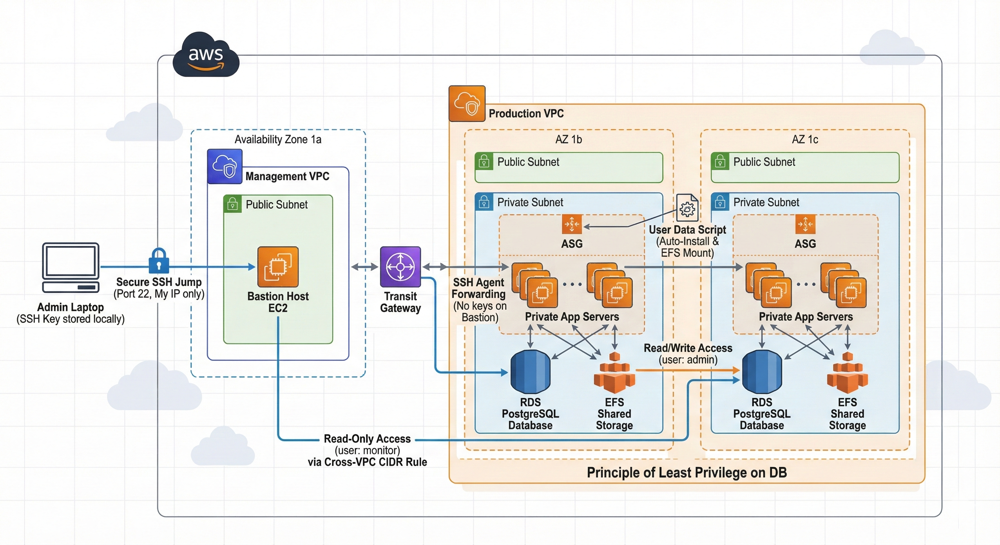

# ☁️ Secure AWS 3-Tier Architecture with Hybrid Connectivity

## 📖 Project Overview
This project demonstrates a production-grade **3-Tier Architecture on AWS**, designed with a "Security-First" approach. It features a segregated network structure (Management vs. Production VPCs), automated infrastructure scaling, and strict access controls following the **Principle of Least Privilege**.

The infrastructure bridges a secure Management environment (Bastion) with a Production environment via VPC Peering/Transit Gateway.

---

## 🏗️ Architecture Diagram
![Architecture Diagram]

<a href="https://youtu.be/Q4YCyA1KFXE" target="_blank">
 
</a>

### Key Components
* **VPC Design:** Dual VPC setup (Management VPC & Production VPC).
* **Compute:** Auto Scaling Group (ASG) with Launch Templates for high availability.
* **Storage:** Amazon EFS (Elastic File System) for shared content across instances.
* **Database:** Amazon RDS (PostgreSQL) with granular user roles.
* **Security:** SSH Agent Forwarding (Keyless Entry) & Security Group chaining.

---

## 🛡️ Key Security Implementations

### 1. SSH Agent Forwarding (Keyless Authentication)
To prevent credential theft, **no private key files (`.pem`) are stored on the Bastion Host**.
* **Mechanism:** I utilize SSH Agent Forwarding to pass credentials from the local machine through the Bastion tunnel directly to the Private EC2.
* **Command:**
    ```bash
    # On Local Machine
    ssh-add -K projectkey.pem
    ssh -A -i projectkey.pem ec2-user@<BASTION-IP>
    # From Bastion (No key needed)
    ssh ec2-user@<PRIVATE-IP>
    ```

### 2. Database Principle of Least Privilege (RBAC)
Database access is restricted based on the user's role/location. The `postgres` admin user is NOT used for application connections.

| Role | User | Permission | Scope |
| :--- | :--- | :--- | :--- |
| **Application** | `admin` | **Read & Write** | Used by PHP App on Private Server |
| **Monitoring** | `monitor` | **Read Only** | Used by Engineers on Bastion Host |


### 🎥 Project Implementation Demo
Click the image below to watch the COMPLETE WALKTHROUGH:
[](https://youtu.be/TUMHARA_VIDEO_LINK)


**SQL Implementation:**
```sql
-- Read-Only User for Bastion
CREATE USER human_view WITH PASSWORD 'SecurePass';
GRANT SELECT ON ALL TABLES IN SCHEMA public TO human_view;
-- Blocks DELETE/UPDATE commands from Bastion.

⚙️ Automation & Deployment
User Data Script (Bash)
The following script handles the automatic configuration of new instances launched by the ASG. It installs dependencies, mounts EFS, and deploys the web server.
#!/bin/bash
# Logging for debugging
exec > >(tee /var/log/user-data.log|logger -t user-data -s 2>/dev/console) 2>&1

# 1. Update & Install Stack
yum update -y
yum install -y amazon-efs-utils httpd php python3-pip
dnf install -y postgresql15
pip3 install botocore

# 2. Mount Shared Storage (EFS)
mkdir -p /var/www/html
mount -t efs -o tls fs-0e253ea714a0e4cfb:/ /var/www/html

# 3. Permissions & Start Service
chown -R ec2-user:apache /var/www/html
chmod 2775 /var/www/html
systemctl start httpd
systemctl enable httpd

# 4. Generate Dynamic Index
echo "<?php echo \"<h1>App Server: \" . gethostname() . \"</h1>\"; ?>" > /var/www/html/index.php

🔧 Troubleshooting Log
During the deployment, several challenges were resolved:

Windows SSH Agent Error (1058):-
Issue: SSH Agent service was disabled on local Windows machine.
Fix: Powershell command Set-Service ssh-agent -StartupType Manual and Start-Service.

Cross-VPC Database Connection:-
Issue: RDS Security Group rejected Bastion Security Group ID.
Fix: Configured Inbound Rules to allow traffic from the Management VPC CIDR Range (10.0.0.0/16) instead of SG ID.

Launch Template Version Mismatch:-
Issue: ASG was launching instances with old User Data.
Fix: Updated ASG configuration to use Launch Template Version: Latest and performed Instance Refresh.

🚀 Future Scope
Implement Application Load Balancer (ALB) with HTTPS/SSL.
Migrate database credentials to AWS Secrets Manager.
Set up CloudWatch Alarms for CPU & Memory utilization.


